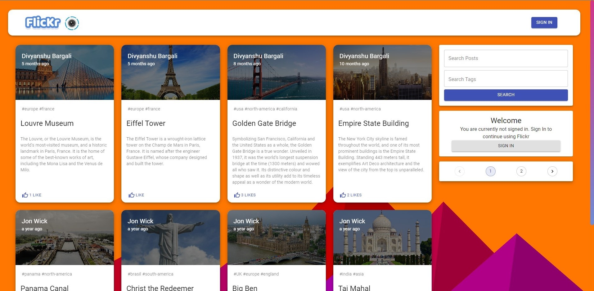

# Flickr

Flickr application build in node-js runtime environment and react library

## Feature

- User Login
- User Signup
- User Create post (Like and delete post)

## Mocks

## Dependencies

- react-redux
- moment
- material-ui
- react-google-login
- express
- nodemon
- mongoose
